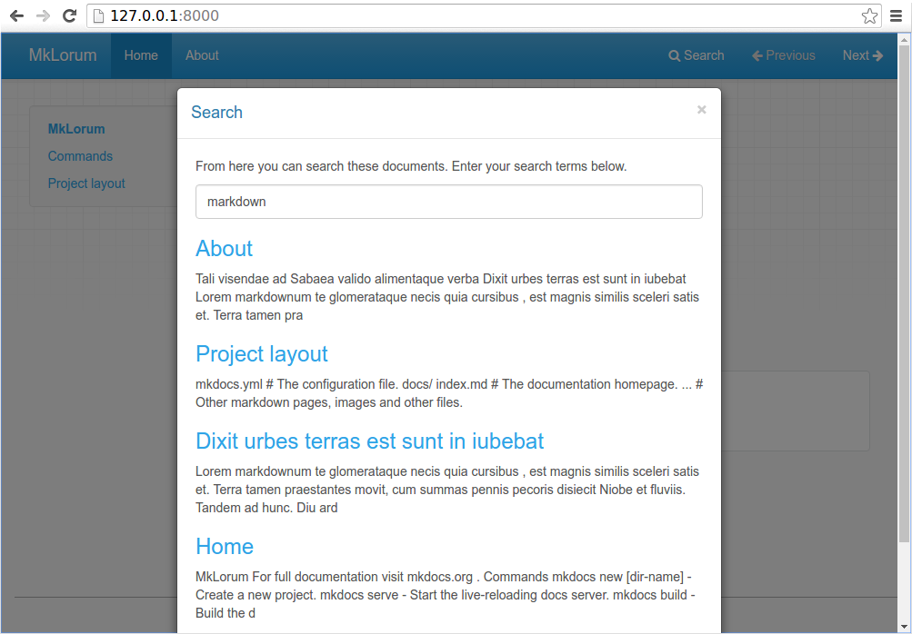

# Welcome to MkDocs

For full documentation visit [mkdocs.org](https://www.mkdocs.org).

# Installation

To install MkDocs, run the following command from the command line:

``` shell
$ pip install mkdocs
```

# Creating a Project

Getting started is super easy. To create a new project, run the following command from the command line:


``` shell
$ mkdocs new my-project
$ cd my-project
```
or 

For current directory, if you are in the directory you want to create the project in, without additional directory
Run the following command from the command line:

``` shell
$ mkdocs new .        
```
or if you clone the repo, you can run the following command from the command line:

``` shell
$ pip install -r requirements.txt # install the requirements
```

# Project layout

    mkdocs.yml    # The configuration file.
    docs/
        index.md  # The documentation homepage.
        ...       # Other markdown pages, images and other files.


Take a moment to review the initial project that has been created for you.

 


There's a single configuration file named `mkdocs.yml`, and a folder named `docs` that will contain your documentation source files (`docs` is the default value for the `docs_dir` configuration setting). Right now the `docs` folder just contains a single documentation page, named `index.md`.

MkDocs comes with a built-in dev-server that lets you preview your documentation as you work on it. Make sure you're in the same directory as the `mkdocs.yml` configuration file, and then start the server by running the `mkdocs serve` command:

``` shell
$ mkdocs serve
INFO    -  Building documentation...
INFO    -  Cleaning site directory
[I 160402 15:50:43 server:271] Serving on http://127.0.0.1:8000
[I 160402 15:50:43 handlers:58] Start watching changes
[I 160402 15:50:43 handlers:60] Start detecting changes
```

Open up http://127.0.0.1:8000/ in your browser, and you'll see the default home page being displayed:


The dev-server also supports auto-reloading, and will rebuild your documentation whenever anything in the configuration file, documentation directory, or theme directory changes.

Open the docs/index.md document in your text editor of choice, change the initial heading to MkLorum, and save your changes. Your browser will auto-reload and you should see your updated documentation immediately.

Now try editing the configuration file: mkdocs.yml. Change the site_name setting to MkLorum and save the file.

``` yaml
site_name: MkLorum
site_url: https://example.com/
```

Your browser should immediately reload, and you'll see your new site name take effect.


!!! note
    The site_name and site_url configuration options are the only two required options in your configuration file. When you create a new project, the site_url option is assigned the placeholder value: https://example.com. If the final location is known, you can change the setting now to point to it. Or you may choose to leave it alone for now. Just be sure to edit it before you deploy your site to a production server.


# Adding pages

As our documentation site will include some navigation headers, you may want to edit the configuration file and add some information about the order, title, and nesting of each page in the navigation header by adding a nav setting:

``` yaml
site_name: MkLorum
site_url: https://example.com/
nav:
    - MkDocs: mkdocs.md
    - Setup: setup.md
    - CI/CD: cicd.md
    - Docs: index.md
```

Save your changes and you'll now see a navigation bar with Home and About items on the left as well as Search, Previous, and Next items on the right.


Try the menu items and navigate back and forth between pages. Then click on Search. A search dialog will appear, allowing you to search for any text on any page. Notice that the search results include every occurrence of the search term on the site and links directly to the section of the page in which the search term appears. You get all of that with no effort or configuration on your part!



## Commands

* `mkdocs new [dir-name]` - Create a new project.
* `mkdocs serve` - Start the live-reloading docs server.
* `mkdocs build` - Build the documentation site.
* `mkdocs -h` - Print help message and exit.

